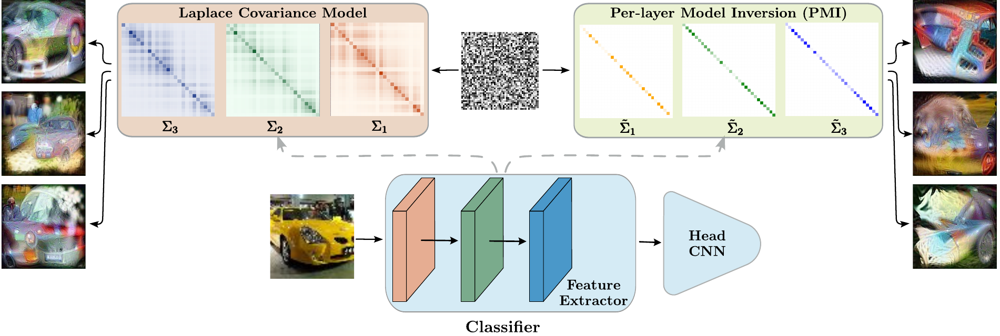

# Stop Marginalizing My Dreams: Model Inversion via Laplace Kernel for Continual Learning

<p align="center">

</p>

## Abstract <a id="abstract"></a>

Data-free continual learning (DFCIL) relies on model inversion to synthesize pseudo-samples and mitigate catastrophic forgetting. However, existing inversion methods are fundamentally limited by a simplifying assumption: they model feature distributions using diagonal covariance, effectively ignoring correlations that define the geometry of learned representations. As a result, synthesized samples often lack fidelity, limiting knowledge retention. In this work, we show that modeling feature dependencies is a key ingredient for effective DFCIL. We introduce \our{}, a structured covariance modeling framework that enables scalable full-covariance modeling without the prohibitive cost of dense matrix inversion and log-determinant computation. By leveraging a Laplace kernel parameterization, \our{} captures structured feature dependencies using memory that scales linearly with the feature dimensionality, while requiring only an additional logarithmic factor in computation. Modeling these correlations produces more coherent synthetic samples and consistently improves performance across standard DFCIL benchmarks. Our results demonstrate that moving beyond diagonal assumptions is essential for effective and scalable data-free continual learning.

## Setup

This implementation requires Python 3.9.18 and Conda.

Create and activate the environment with:

```bash
conda env create -f environment.yml
conda activate <env_name>
```

### Codebase Overview

- The continual learning implementation for the ResNet-32 backbone (corresponding to Table 1 in the paper) is provided in the `resnet32` directory. Since the feature dimensionality in this setting is relatively moderate, the exact Gaussian Negative Log-Likelihood (NLL) is computed directly.

- The continual learning implementation for the ViT backbone (corresponding to Table 2 in the paper) is provided in the `clip` directory. Similarly, due to the moderate feature dimensionality, the exact Gaussian NLL is evaluated explicitly.

- The `visualizations` directory contains model inversion pipelines based on pretrained ResNet-34 and ViT backbones, together with the efficient structured NLL computation used for high-dimensional feature-map inversion and qualitative sample generation.